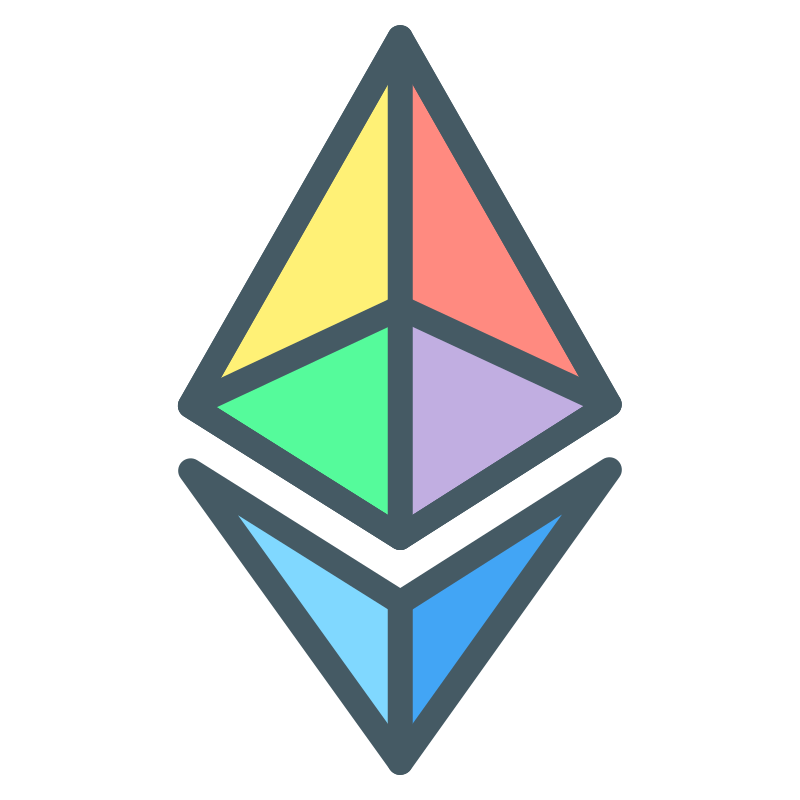
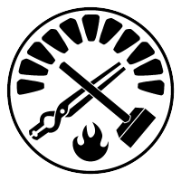
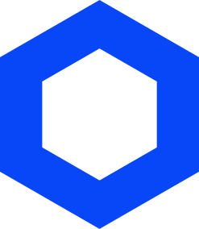
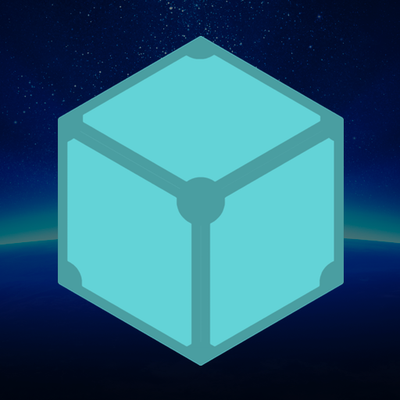
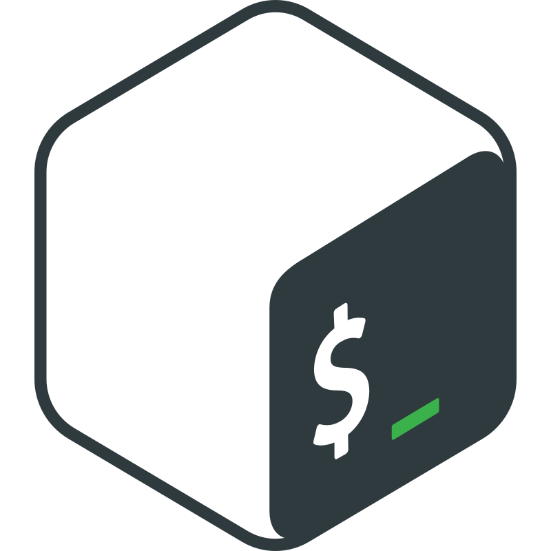

<h1 align="center">Hi 👋, I'm Amit Prasad</h1>
<h3 align="center">A passionate Ethereum developer</h3>

<!--
Hi! This is an easter egg.
Congratulations you found the first one!
-->

  

  

- 🔭 I’m currently working on **nothing as of now, thinking of new ideas for my next DApp**

- 🌱 I’m currently researching and learning **EIPs and ERCs**

- 👯 I’m looking to collaborate on **open source projects**

- 👾 I work on a **Minecraft Modpack (NITRO)** and listen to music in my free time

- ⚡ Fun fact: **I use arch-based distro btw (CachyOS KDE Plasma/X11 user)**

<h3 align="center">Connect with me:</h3>

<h3 align="center">Tech Stack:</h3>

<table align="center">
  <!-- Web3 / Blockchain -->
  <tr>
    <td align="center"> Solidity</td>
    <td align="center"> Ethereum</td>
    <td align="center"> Foundry</td>
    <td align="center"> Chainlink</td>
    <td align="center"> Remix</td>
    <td align="center"> IPFS</td>
  </tr>
  <!-- Frontend / Build -->
  <tr>
    <td align="center"> React</td>
    <td align="center"> TypeScript</td>
    <td align="center"> JavaScript</td>
    <td align="center"> HTML5</td>
    <td align="center"> CSS3</td>
    <td align="center"> Tailwind</td>
  </tr>
  <!-- Backend / Infra -->
  <tr>
    <td align="center"> Node.js</td>
    <td align="center"> Express</td>
    <td align="center"> Docker</td>
    <td align="center"> MongoDB</td>
    <td align="center"> Firebase</td>
    <td align="center"> Supabase</td>
  </tr>
  <!-- Tools / Editors -->
  <tr>
    <td align="center"> C++</td>
    <td align="center"> Bash</td>
    <td align="center"> Git</td>
    <td align="center"> VS Code</td>
    <td align="center"> Kate</td>
    <td align="center"> Zed</td>
  </tr>
</table>

<h3 align="center">GitHub Stats:</h3>

  

  <picture>
    <source media="(prefers-color-scheme: dark)" srcset="https://raw.githubusercontent.com/Copernicium282/Copernicium282/gh-pages/snake-dark.svg" />
    <source media="(prefers-color-scheme: light)" srcset="https://raw.githubusercontent.com/Copernicium282/Copernicium282/gh-pages/snake.svg" />
    
  </picture>

